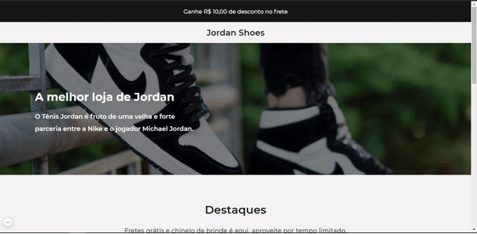

  

<h1 align="center">Codelândia | Landing Page Shoes</h1>

<h2 align="center">Descrição</h2>

  Segundo desafio da Comunidade Codelândia 

 <a href="#descricao">Descricão</a> •
 <a href="#tecnologias">Tecnologias</a> •

## 🛠️ Tecnologias

Principais tecnologias utilizadas no desenvolvimento do projeto:

- HTML
- Javascript
- CSS
- Typed.js
- ScrollReveal.js

## ⚙️ Como contribuir

- Faça um fork desse repositório;
- Crie uma branch com a sua feature: `git checkout -b minha-feature`;
- Faça commit das suas alterações: `git commit -m 'feat: Minha nova feature'`;
- Faça push para a sua branch: `git push origin minha-feature`.

---

Feito com 💙 por <a href="https://www.linkedin.com/in/silviodiasjr/">Silvio Dias</a>
